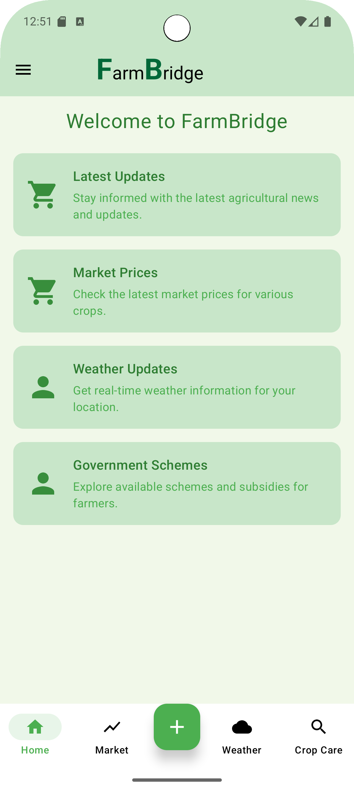
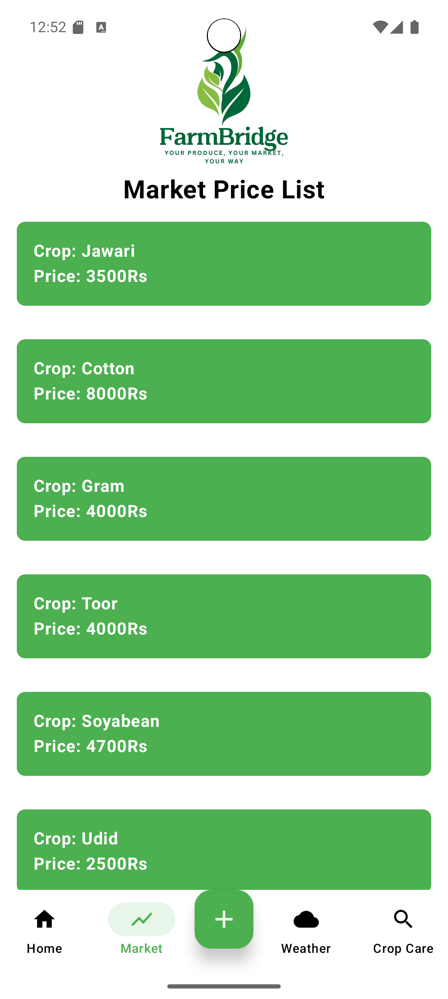
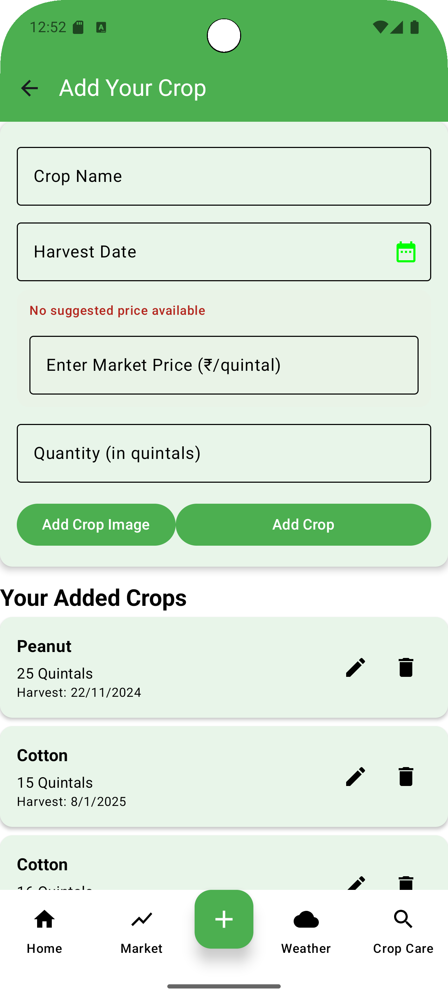
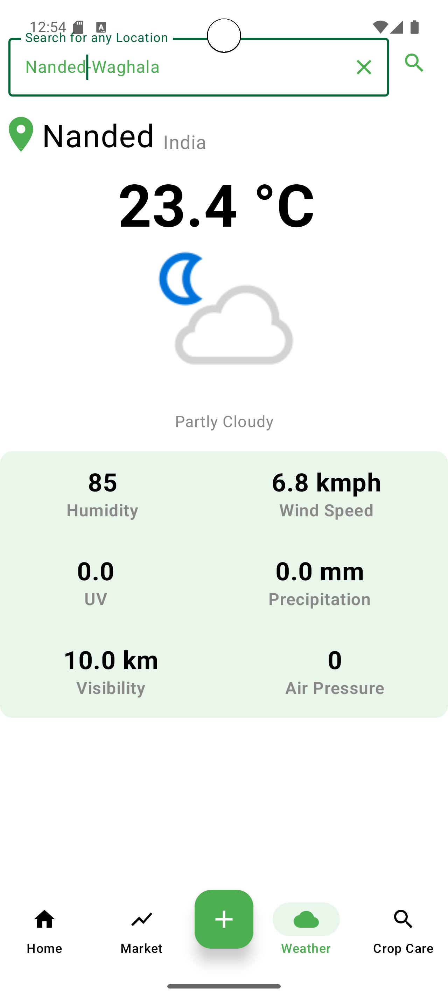

# 🌾 FarmBridge – Connecting Farmers to the Market

**FarmBridge** is an Android application designed to empower farmers by bridging the gap between agriculture, technology, and markets. It helps farmers sell crops directly, track market prices, recognize plant diseases, and access government schemes, all in one simple and multilingual app.

---

## 🧠 About the Project

FarmBridge provides farmers with real-time agricultural insights, weather information, and direct market access. It integrates modern Android technologies with Firebase to offer a smooth, secure, and scalable experience for the farming community.

---

## ✨ Key Features

### 👨‍🌾 Farmer Features
- 📈 **Daily Market Prices** – View live crop prices updated via Firebase in real-time
- 🌱 **Plant Disease Recognition** – Identify plant diseases using image recognition and get fertilizer suggestions
- 💧 **Expense Tracker** – Track the amount spent on each crop for better financial management
- 🌦️ **Weather Updates** – Get real-time weather forecasts using weather API integration
- 🏛️ **Government Schemes** – Stay updated with the latest agriculture-related government schemes
- 🧠 **New Agriculture Technologies** – Learn about innovative farming tools and modern practices
- 🪙 **Sell Your Crops** – Farmers can list their crops for sale directly to buyers

### 🌐 Multilingual Support
- Available in **English, Hindi, and Marathi**
- Uses `strings.xml` for dynamic translation
- Language settings saved via `LanguageViewModel` & `LanguageRepository` using `SharedPreferences`

---

## 🧩 Tech Stack

| Technology | Description |
|-------------|-------------|
| **Kotlin + Jetpack Compose** | Modern UI framework for declarative Android apps |
| **Firebase Firestore** | Cloud NoSQL database for real-time and structured data |
| **Firebase Storage** | Store images of crops and disease identification |
| **Firebase Authentication** | Secure login for farmers and administrators |
| **MVVM Architecture** | Clean separation of UI and business logic |
| **Retrofit** | For fetching weather and external API data |
| **Material 3 Design** | Clean and user-friendly UI components |

---

## 🧭 App Modules / Screens

| Screen | Description |
|:-------|:-------------|
| **Dashboard** | Central hub showing latest updates, weather, and quick actions |
| **Market Prices** | Displays daily crop prices fetched from Firebase |
| **Add Crop** | Farmers can upload crop details with images for selling |
| **Plant Disease Recognition** | AI-based disease detection with treatment suggestions |
| **Weather Screen** | Shows current and forecasted weather conditions |
| **Expense Tracker** | Track and manage spending per crop |
| **Government Schemes** | List of active and upcoming government schemes |
| **New Agri-Tech** | Articles and information on modern farming technologies |

---

## 📂 Project Structure (MVVM)

```
FarmBridge/
│
├── data/
│   ├── model/              # Data classes (MarketPrice, Crop, WeatherInfo, etc.)
│   ├── repository/         # Repository classes (Firebase, Weather API handling)
│   └── local/              # SharedPreferences or local DB (if any)
│
├── ui/
│   ├── screens/            # Each screen like Dashboard, Market, Weather, etc.
│   │   ├── Dashboard.kt
│   │   ├── Market.kt
│   │   ├── Weather.kt
│   │   ├── PlantDisease.kt
│   │   ├── ExpenseTracker.kt
│   │   └── AddCrop.kt
│   ├── components/         # Reusable composables (Cards, Buttons, etc.)
│   └── navigation/         # Navigation graph & routes
│
├── viewmodel/
│   ├── MarketViewModel.kt
│   ├── LanguageViewModel.kt
│   ├── WeatherViewModel.kt
│   ├── PlantDiseaseViewModel.kt
│   └── ExpenseViewModel.kt
│
├── utils/
│   ├── PreferenceHelper.kt # Manage SharedPreferences for language or settings
│   └── Constants.kt        # Common constants and utility functions
│
├── MainActivity.kt         # Entry point with NavHostController
├── build.gradle
└── README.md
```

---

## 🖼️ Screenshots

> Place all screenshots inside a `screenshots/` folder in your repository.

| Dashboard | Market Prices | 
|------------|---------------|
|  |  

| Add Crop | Weather | 
|----------|---------|
|  |  |


---

## 🚀 How to Run

1. **Clone this repository**
   ```bash
   git clone https://github.com/<your-username>/FarmBridge.git
   cd FarmBridge
   ```

2. **Open in Android Studio**
   - Open Android Studio and select "Open an Existing Project"
   - Navigate to the cloned FarmBridge directory

3. **Add Firebase Configuration**
   - Download `google-services.json` from your Firebase Console
   - Place it in the `app/` directory

4. **Sync Gradle**
   - Click on "Sync Project with Gradle Files"
   - Wait for dependencies to download

5. **Run the App**
   - Connect an Android device or start an emulator
   - Click the "Run" button in Android Studio

---

## 🔧 Prerequisites

- Android Studio Arctic Fox or later
- Android SDK 24 or higher
- Firebase account with Firestore and Storage enabled
- Internet connection for API calls

---

## 📦 Dependencies

```gradle
dependencies {
    // Jetpack Compose
    implementation("androidx.compose.ui:ui")
    implementation("androidx.compose.material3:material3")
    implementation("androidx.activity:activity-compose")
    
    // Firebase
    implementation("com.google.firebase:firebase-firestore-ktx")
    implementation("com.google.firebase:firebase-storage-ktx")
    implementation("com.google.firebase:firebase-auth-ktx")
    
    // Retrofit for API calls
    implementation("com.squareup.retrofit2:retrofit")
    implementation("com.squareup.retrofit2:converter-gson")
    
    // ViewModel & LiveData
    implementation("androidx.lifecycle:lifecycle-viewmodel-compose")
    implementation("androidx.lifecycle:lifecycle-runtime-ktx")
    
    // Navigation
    implementation("androidx.navigation:navigation-compose")
}
```

---

## 🧠 Future Enhancements

- 🤖 **Advanced AI Recommendations** – ML-based fertilizer and pesticide recommendations
- 📍 **Government Database Integration** – Sync with official databases for schemes
- 💬 **Farmer-Buyer Chat** – Direct messaging system between farmers and buyers
- 🧾 **Export Data** – Excel/CSV export for expense and market data
- 🌐 **Offline Mode** – Support for areas with low connectivity
- 📊 **Analytics Dashboard** – Detailed insights on crop performance and expenses
- 🔔 **Push Notifications** – Alerts for price changes and weather warnings

---

## 🤝 Contributing

Contributions are welcome! Please follow these steps:

1. Fork the repository
2. Create a new branch (`git checkout -b feature/amazing-feature`)
3. Commit your changes (`git commit -m 'Add some amazing feature'`)
4. Push to the branch (`git push origin feature/amazing-feature`)
5. Open a Pull Request

---

## 📄 License

This project is licensed under the MIT License - see the [LICENSE](LICENSE) file for details.

---

## 🧑‍💻 Developed By

**Jaykumar Gupta**  
- App Head – Google Developer Group SGGS  
- President – SWAG (SGGS Web, App & Game Development Club)  
- 📍 SGGSIE&T, Nanded

---

## 📞 Contact

For queries or suggestions, reach out:
- **Email:** [jaykumar636904@gmail.com](mailto:jaykumar636904@gmail.com)
- **LinkedIn:** [Jaykumar Gupta](https://www.linkedin.com/in/jaykumar-gupta-aba7312a7)


**Made with ❤️ for Indian Farmers**
